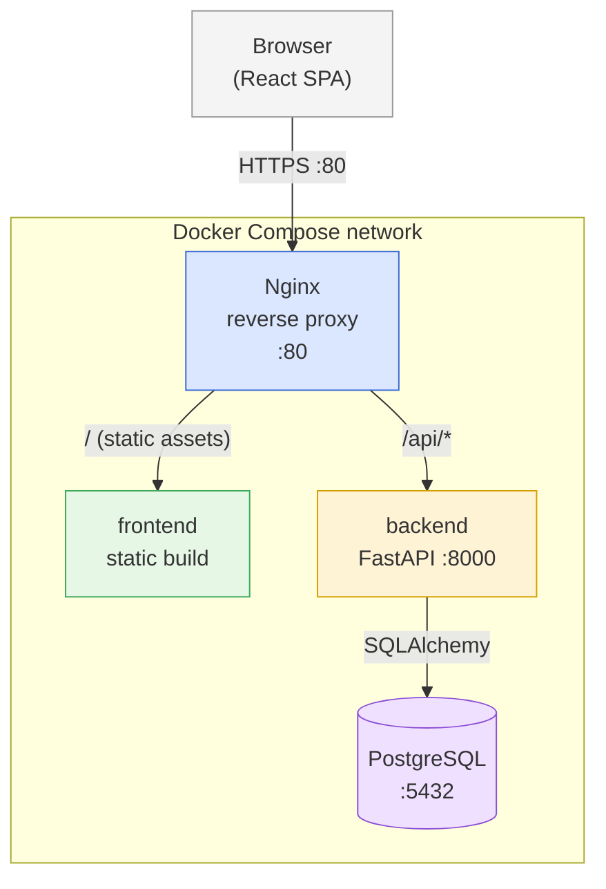
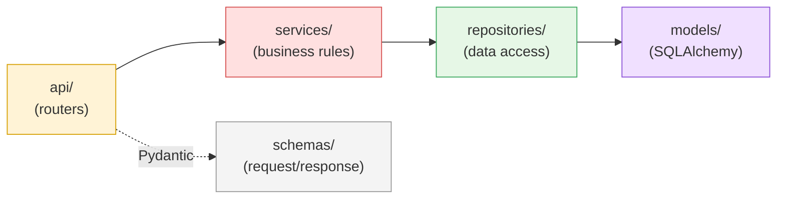
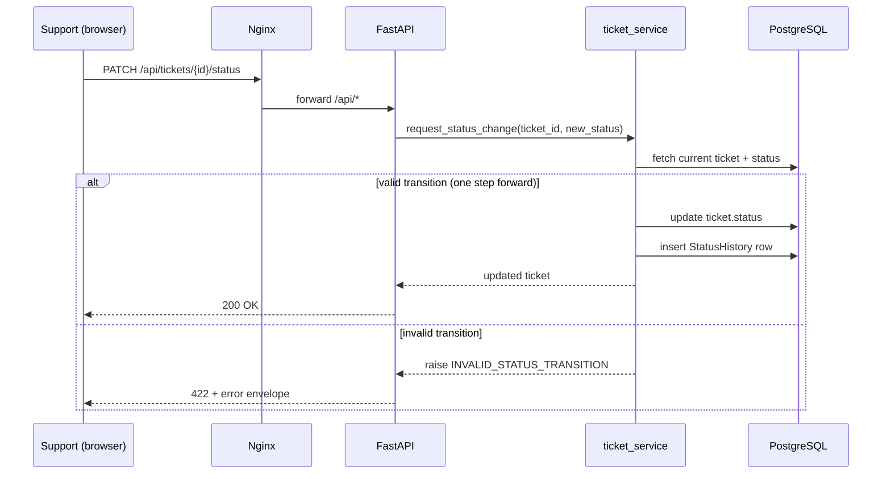

# Architecture — Internal Support Ticket Portal

> This document describes the technical architecture, the reasoning behind
> each major decision, and the contracts other engineers (human or AI) need
> to respect when working on this codebase.
>
> Detailed rationale for individual decisions lives in
> [`docs/adr/`](docs/adr/) as lightweight ADRs (Architecture Decision
> Records). This file stays intentionally high-level; read an ADR only when
> you need the full trade-off discussion.

## 1. System overview

A small internal tool with two actors:

- **Employee** — submits support tickets and tracks their own requests.
- **Support agent** — triages, filters, and manages the lifecycle of every
  ticket.

### 1.1 Container view



All four components (`frontend`, `backend`, `db`, `nginx`) run as Docker
Compose services on the same network. Nginx is the **only** service
exposed to the host; the SPA build and the API are never reachable
directly (see [ADR 0005](docs/adr/0005-reverse-proxy.md)).

### 1.2 Backend layering



Requests flow strictly left to right. A router never imports
`repositories/` directly, and `services/` never imports FastAPI types —
this is what keeps the status-workflow rule (§4) unit-testable with no
HTTP or DB mocking.

### 1.3 Status transition flow



## 2. Technology stack

| Layer | Choice | ADR |
|---|---|---|
| Backend framework | FastAPI | [0001](docs/adr/0001-backend-framework.md) |
| Database | PostgreSQL + SQLAlchemy + Alembic | [0002](docs/adr/0002-database.md) |
| Authentication | JWT, roles `employee` / `support` | [0003](docs/adr/0003-authentication.md) |
| Frontend | React + Vite + TanStack Query | — |
| E2E testing | Cypress | [0004](docs/adr/0004-e2e-testing.md) |
| Reverse proxy | Nginx | [0005](docs/adr/0005-reverse-proxy.md) |
| Orchestration | Docker Compose | [0005](docs/adr/0005-reverse-proxy.md) |
| CI | GitHub Actions | §7 |

## 3. Repository layout (monorepo)

```
.
├── backend/
│   ├── app/
│   │   ├── api/            # FastAPI routers (thin controllers)
│   │   ├── schemas/        # Pydantic request/response models
│   │   ├── models/         # SQLAlchemy ORM models
│   │   ├── services/       # business rules (status workflow, auth)
│   │   ├── repositories/   # data access, isolated from business logic
│   │   ├── core/           # settings, DB session, security utils
│   │   └── main.py
│   ├── alembic/
│   │   └── versions/       # schema migrations, incl. user seed
│   ├── tests/
│   │   ├── unit/
│   │   └── integration/
│   ├── pyproject.toml
│   └── Dockerfile
├── frontend/
│   ├── src/
│   │   ├── api/            # typed API client (fetch wrappers)
│   │   ├── components/
│   │   ├── pages/
│   │   ├── hooks/           # TanStack Query hooks
│   │   └── types/
│   ├── cypress/
│   │   └── e2e/
│   ├── vite.config.ts
│   └── Dockerfile
├── nginx/
│   └── default.conf
├── docs/
│   └── adr/
├── .github/workflows/ci.yml
├── docker-compose.yml
├── AGENTS.md
└── README.md
```

Layer boundary rule: `api/` never talks to `repositories/` directly, and
`services/` never imports FastAPI types. This keeps business rules
(the status workflow above all) testable in isolation, with no HTTP or DB
mocking required for unit tests.

## 4. Domain model

```
User            id, email, hashed_password, role (employee | support)
Ticket          id, title, description, category, priority, status,
                 created_by (FK User), created_at, updated_at
StatusHistory   id, ticket_id (FK Ticket), from_status (nullable),
                 to_status, changed_by (FK User), changed_at
```

`StatusHistory` is a separate table, not a JSON blob on `Ticket`, so the
detail view can render a full timeline and the audit trail survives even
if the ticket itself is edited later.

**Status workflow** (enforced in `services/ticket_service.py`, not in the
router or the ORM layer):

```
Open → In Progress → Resolved → Closed
```

One step at a time, no skipping, no going backward. Any other transition
raises `INVALID_STATUS_TRANSITION` (422). A transition to `Resolved`
additionally requires a non-empty `resolution_note`; without it the request
is rejected with `RESOLUTION_NOTE_REQUIRED` (422). The transition is applied
with a compare-and-swap `UPDATE ... WHERE status = :expected` (rowcount
checked), so two concurrent support actions cannot both commit the same
step. This rule is the single most important piece of business logic in the
system and is where unit test coverage is the strictest.

## 5. API contract

Base path: `/api`. All authenticated routes expect
`Authorization: Bearer <jwt>`.

| Method | Path | Role | Purpose |
|---|---|---|---|
| POST | `/auth/login` | public | Returns an access token + refresh token + role |
| POST | `/auth/refresh` | public (valid refresh token) | Rotates the refresh token, returns a new pair |
| POST | `/auth/logout` | public (valid refresh token) | Revokes the refresh token server-side |
| POST | `/tickets` | employee, support | Create a ticket |
| GET | `/tickets` | employee (own only), support (all) | List, filter, sort, paginate |
| GET | `/tickets/{id}` | employee (own only), support | Full detail + status history |
| PATCH | `/tickets/{id}/status` | support only | Advance the workflow |

Query params on `GET /tickets`: `status`, `category`, `priority`,
`sort_by` (`created_at` \| `priority`), `order` (`asc` \| `desc`), `page`,
`page_size`.

**Error envelope** (used for every 4xx/5xx response):

```json
{
  "error": {
    "code": "INVALID_STATUS_TRANSITION",
    "message": "Cannot move from 'Open' to 'Closed' directly.",
    "status": 422
  }
}
```

A fixed enum of `code` values (`INVALID_STATUS_TRANSITION`,
`TICKET_NOT_FOUND`, `UNAUTHORIZED`, `VALIDATION_ERROR`, `FORBIDDEN`,
`RESOLUTION_NOTE_REQUIRED`, `NOT_FOUND`, `HTTP_ERROR`) lets the frontend map
errors to user-facing copy without string matching on `message`.

## 6. Security model

- Passwords hashed with `bcrypt`.
- JWT signed with `HS256`. Access tokens are short-lived (1h); a refresh
  token (30d) is issued alongside at login, persisted server-side and
  hardened with rotation and server-side revocation — every refresh token
  carries a `jti`, is revoked when it is rotated, and is revoked on logout
  (see [ADR 0006](docs/adr/0006-post-review-hardening.md)).
- `JWT_SECRET_KEY` is required at startup — the app refuses to boot without
  it, so no environment ever runs on a key committed to git.
- Two seed users only (`employee@company.com`, `support@company.com`),
  created via an Alembic migration (see [ADR 0002](docs/adr/0002-database.md)),
  not an ad-hoc startup script — the seed is versioned like any other
  schema change and reproducible in every environment, including CI.
- Authorization is role-based and enforced in `services/`, never assumed
  from the frontend.

## 7. Testing strategy

| Level | Tool | Scope | Coverage gate |
|---|---|---|---|
| Unit | pytest | `services/` (status workflow, validation) | ≥ 80% |
| Integration | pytest + `TestClient` | API routes against a real test DB (Postgres in CI, via container) | ≥ 80% |
| Unit/Integration | Vitest + React Testing Library | components, hooks | ≥ 80% |
| E2E | Cypress | full user flows (create ticket, filter, change status) against the Dockerized stack | critical paths only |

Coverage gates are configured — `pytest --cov-fail-under=80` on the
backend and Vitest `coverage.thresholds` on the frontend — and run as part
of the suites. CI enforcement (a job that fails the pipeline below 80%) is
described in §8 but not yet built; the gates are currently run manually.

## 8. CI pipeline (GitHub Actions)

> **Not implemented in this submission** — `AGENTS.md` item 9 is
> deliberately out of scope. The jobs below describe the intended pipeline
> (see [ADR 0006](docs/adr/0006-post-review-hardening.md)); running the
> commands manually is how quality is currently checked.

Parallel jobs on every push/PR:

1. `backend-test` — lint (`ruff`) + `pytest --cov` against a Postgres
   service container.
2. `frontend-test` — lint (`eslint`) + `vitest run --coverage`.
3. `build` — builds both Docker images (fails fast on Dockerfile issues).
4. `e2e` (runs after 1–3 pass) — `docker compose up`, wait for healthy,
   run Cypress headless against Nginx.

Coverage thresholds are checked in jobs 1 and 2; the pipeline fails below
80%.

## 9. Assumptions

- Two fixed roles are enough; no admin/user management UI is required.
- Category list (`IT`, `Facilities`, `HR`) is a fixed enum for this
  prototype, not a configurable table — flagged in §10 as a future
  improvement.
- Single-tenant, no multi-company support.

## 10. What I'd improve with more time

- Configurable categories (DB-backed instead of enum).
- A CI pipeline (GitHub Actions) — designed in §8, not yet built.
- Optimistic UI updates on status change (currently refetch-on-success).
- Rate limiting on `/auth/login`.
- Structured logging + request tracing (`correlation-id` header through
  Nginx → FastAPI).
- Soft delete / audit log for ticket edits, not just status changes.
